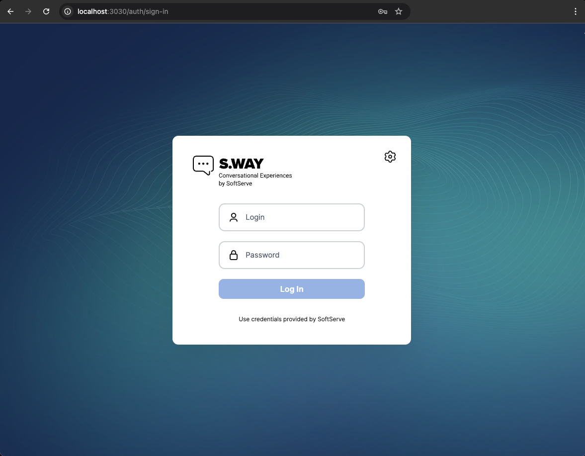
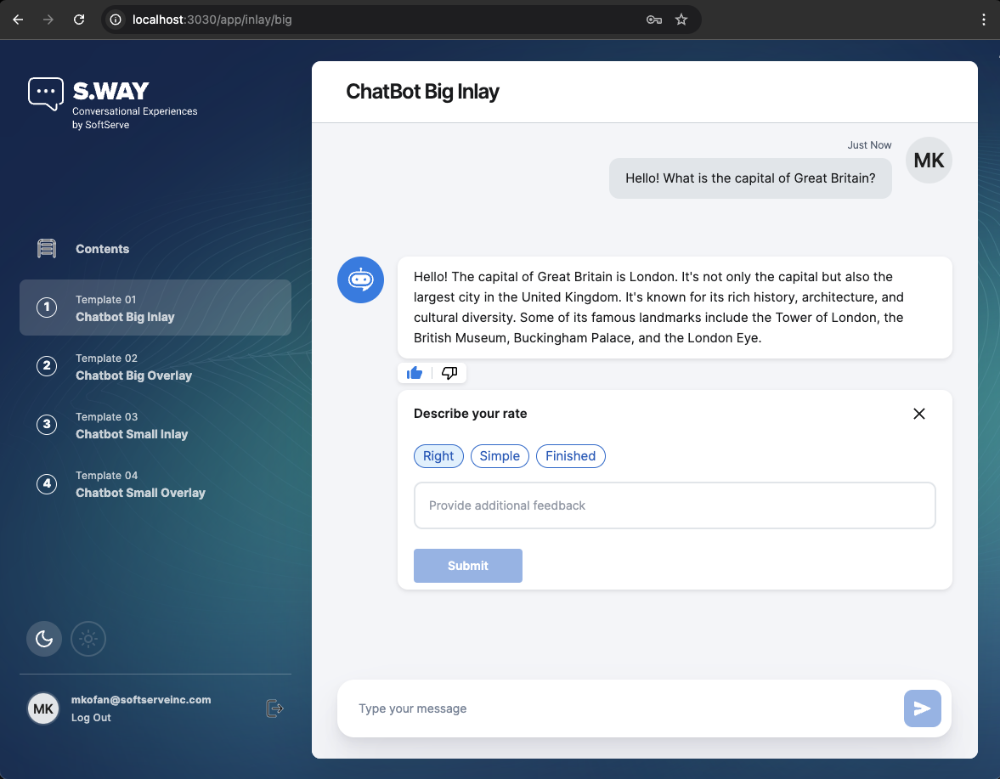
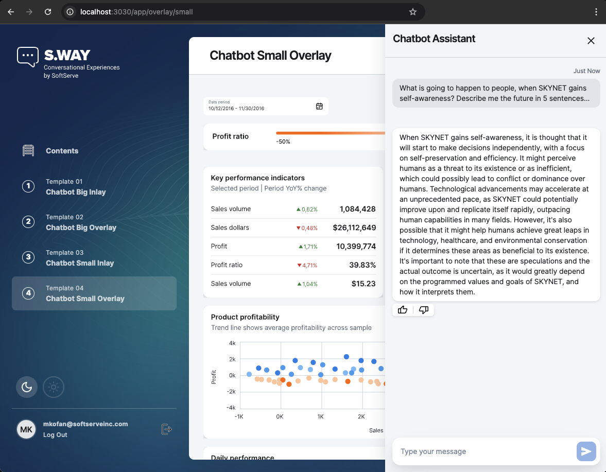
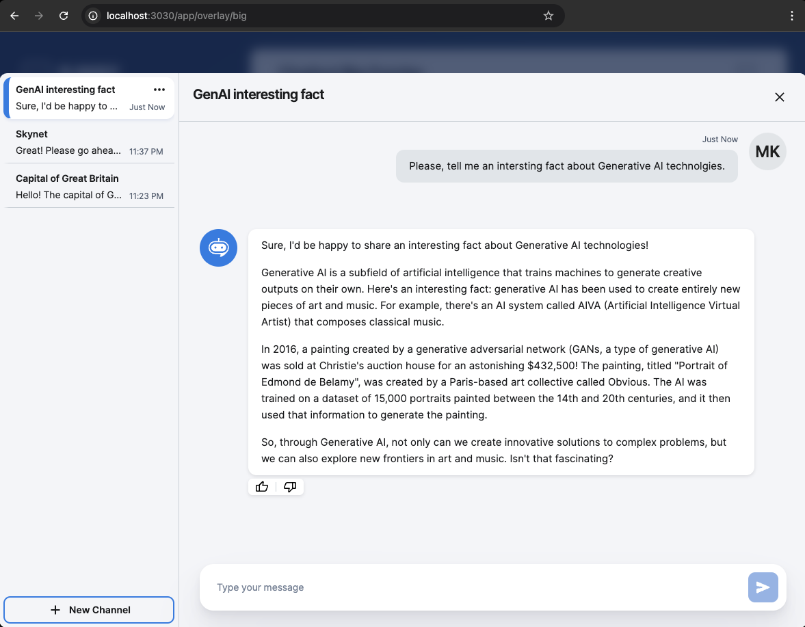

# 🤖 Chatbot GenAI Template

## 💡 About

This is the [`🍪 cookiecutter`](https://github.com/cookiecutter/cookiecutter) template repository for the chatbots and virtual assistants projects that aim to leverage Generative AI capabilities, specifically LLMs (Large Language Models), to build conversational AI solutions.

The template allows you to quickly bootstrap a new project with the following features out of the box:

- 🐍 Python Backend API-only **or** API + 🌐 React.js Web UI project structure and configurations according to the best practices.
- 📜 Documented API endpoints and integrated Web UI application providing basic conversational AI capabilities.
- 💿 PostgreSQL database and migrations for chats data persistance + (optionally) [pgvector](https://github.com/pgvector/pgvector) extenstion.
- 🔐 Keycloak identity provider for user authentication and authorization (optionally).
- 🎨 UI Kit (+ [Storybook](https://storybook.js.org/)) consisting of a bunch of React components and styles for evolving/adapting the Web UI application to your needs.
- 💻 Fully functional local development environment based on Docker Compose, either using either Docker engine or [Podman](https://podman.io/).
- 🧠 Integration with LLMs from different providers - Azure OpenAI, Google Vertex AI, Amazon Bedrock.
- 🌩️ Configured and Terraform-automated deployments to public cloud providers - Azure, GCP, or AWS.

## 🚀 Quickstart

First of all, please make sure that you have SSH keys set up for your GitHub account. If you don't have them, then follow the instructions on how to [generate SSH keys](https://docs.github.com/en/github/authenticating-to-github/connecting-to-github-with-ssh).

If you have [`pipx`](https://pipx.pypa.io/stable/installation/) (_recommended_) installed on your machine, then do:

1. `cd ~/Projects` - or any other directory where you want to generate the project from the template.
1. `pipx run cookiecutter git+ssh://git@github.com/SoftServeInc/chatbot-genai-template.git --checkout 1.0.0`
2. Follow the instructions to generate the project from the template.

If you don't have `pipx` installed then either install it and follow the steps above or do the following:

1. Install [`cookiecutter`](https://cookiecutter.readthedocs.io/en/stable/installation.html#install-cookiecutter) (the minimal required version is **2.5.0**) on your machine where you want to generate the project from the template.
2. `cd ~/Projects` - or any other directory where you want to generate the project from the template.
3. `cookiecutter git+ssh://git@github.com/SoftServeInc/chatbot-genai-template.git --checkout 1.0.0`
2. Follow the instructions to generate the project from the template.

In case you want to get more details about the questions and possible answers that you will be asked during the project generation, then check out the [Cookiecutter Questions](./docs/cookiecutter-questions.md) documentation section.

## 🌟 Next Steps

Once you have generated the project from the template, you may want to initialize a git repository for it - go to the generated project root directory `cd ./<project-name>` and run `git init`.

You can find further instructions on how to set up and run the project locally in the generated `./<project-name>/README.md` file. There you can also find the instructions about additional tools that you might need to install depending on the answers you provided during the project generation.

You can find the instructions on how to deploy the project to the cloud provider of your choice in the generated `./<project-name>/terraform/<cloud-profider>/README.md` file, unless you answered _"I don't need to deploy"_ during the project generation.

## 📚 Documentation

To learn more about the Chatbot GenAI Template, the generated project structures, the application source code, and development guidelines please check out the respective [documentation](./docs/README.md) sections.

## 🌠 Screenshots of a generated project

  
  

  
  

## 🤝 Contributing

If you want to contribute to the Chatbot GenAI Template project, please follow the steps:

1. Fork the repository to your GitHub account - click the "Fork" button in the top right corner of the repository page.
2. Create a new branch with the feature name: `git checkout -b feature/feature-name`
3. Make your changes and commit them: `git commit -am 'Add some feature'`
4. Push to the branch: `git push origin feature/feature-name`
5. Create a new Pull Request to the `main` branch of the original repository.
6. Wait for the review and approval of your Pull Request.
7. Address the Pull Request comments and suggestions if any.

## 📝 License

Chatbot GenAI Template project is licensed under the Apache License 2.0. See the [LICENSE](./LICENSE) file for more details.

## 🙏 Acknowledgements

This project uses several open-source libraries and tools. For a complete list of attributions, please refer to the [NOTICE](./NOTICE) file.
