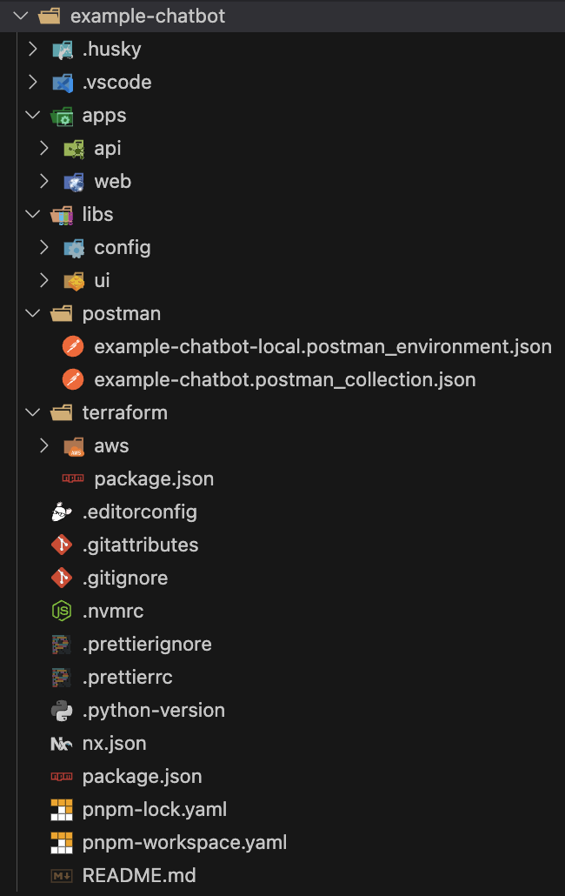

# 🏠 Project with API and Web UI applications

When you choose to include a Web UI application in your project, the generated project will leverage the monorepo approach to organize the source code of the API and Web UI applications. A [_monorepo_](https://monorepo.tools/) is a software development strategy in which the code for several projects is stored in the same repository. There are several potential advantages to a monorepo over individual repositories:

1. Ease of code reuse
1. Simplified dependency management
1. Collaboration across teams
1. Large-scale code refactoring
1. Atomic commits

The generated mono-repository is managed using [Nx](https://nx.dev/) build system.

## 📦 Monorepo packages

The generated mono-repository contains the following packages:

- `apps/api/` - Backend API server for the chatbot written in [FastAPI](https://fastapi.tiangolo.com/).
- `apps/web/` - Frontend Web UI application for the chatbot written in [React.js](https://reactjs.org/).
- `libs/ui/` - UI components library (a.k.a UI Kit) for the chatbot written in [React.js](https://reactjs.org/).
- `libs/config/` - Common development tool configurations used across the repository.
- `terraform/` - Terraform configuration for the deployment of the chatbot to a selected cloud provider.

Each of the packages defines its own `package.json` file with the dependencies and CLI scripts specific to the package.

## 📜 CLI commands

The generated mono-repository defines the following CLI commands that can be executed from the root of the generated project:

- `pnpm compose:up` - start up the local docker-compose environment.
- `pnpm compose:down` - shut down the local docker-compose environment.
- `pnpm compose:remove` - shut down, and remove containers and volumes of the local docker-compose environment.
- `pnpm compose:bootstrap` - clean-up, re-configure, and re-start the local environment from scratch.
- `pnpm start:dev` - starts all applications in development mode.
- `pnpm start` - starts all applications in production mode.
- `pnpm build` - builds all applications.
- `pnpm clean` - removes all previously generated build files and caches.
- `pnpm test` - run unit tests for all applications and libraries.
- `pnpm lint` - run code linting for all applications and libraries.
- `pnpm lint:fix` - run code linting and try to fix the detected problems for all applications and libraries.
- `pnpm format` - format the code according to `prettier` configurations for JS applications and libraries.
- `pnpm deps:remove` - remove all installed dependencies (`node_module`, `.venv`) for all applications and libraries.
- `pnpm deps:reinstall` - remove and reinstall dependencies for all applications and libraries.
- `pnpm deps:update` - remove installed dependencies, remove `{{ cookiecutter.__npm_lock }}` and `poetry.lock` files, and reinstall dependencies for all applications and libraries; as a result of this command all dependencies will be updated to the latest possible versions according to the version constraints specified in `package.json` and `pypoject.yaml` files.

Keep in mind that if during the project generation, you have chosen to use `npm` as a package manager instead of `pnpm`, then you need to replace `pnpm` with `npm run` in the above commands.

## 🪝 Git hooks

1. `.husky/pre-commit`:
   - run code linting and formatting for all staged files, trying to fix the detected problems automatically. Under the hood, it uses [lint-staged](https://github.com/lint-staged/lint-staged) package.
1. `.husky/pre-push`:
   - run code linting for all applications and libraries.
   - run unit tests for all applications and libraries.

## 🗂️ Project structure

The example of the files and directories layout of the generated project is shown below:

To get more details about the generated project structure and source code, please refer to:

- [API application](./app-api.md) documentation.
- [Web UI application](./app-web.md) documentation.
