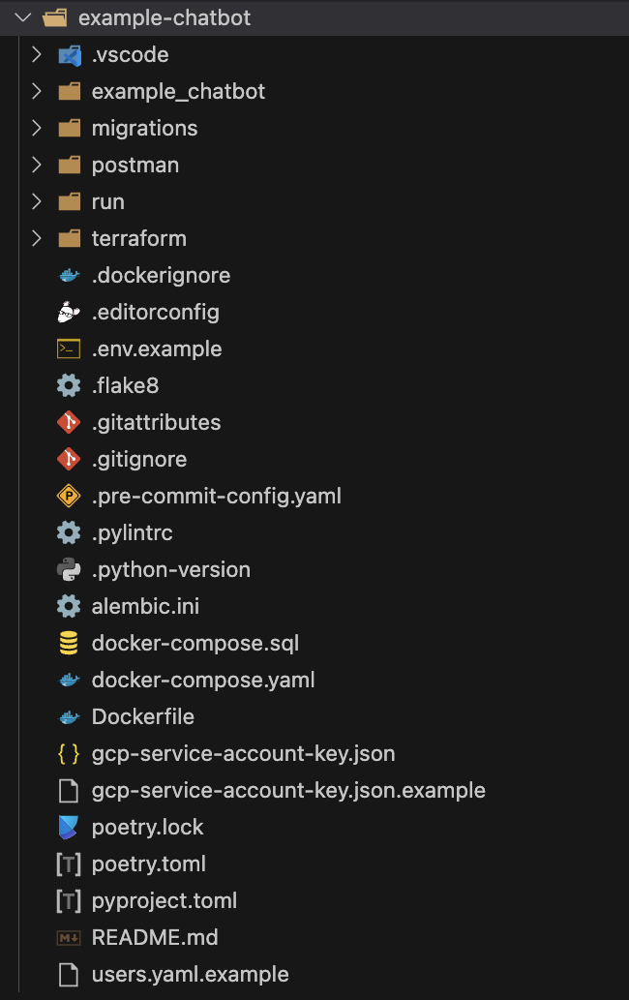

# 🏕️ Project with API application only

When you choose to not include a Web UI application in your project, the generated project will leverage the standard approach to organize the source code of the Python-based Backend API application. The actual source code of the API application is located in the `./<package_name>` directory of the generated project.

## 🪝 Git hooks

The repository is configured to use 🅿️ [pre-commit](https://pre-commit.com/) to manage Git hooks. In fact, `pre-commit` module supports many different types of git hooks (not just pre-commit). At the moment it configures `pre-commit` and `pre-push` hooks to run unit tests, linting and formatting of python code. See the `.pre-commit-config.yaml` file for more details. Also, please refer to the [pre-commit documentation](https://pre-commit.com/) to learn how to use it.

## 📜 CLI commands

To see the list of  CLI commands that can be executed from the root of the generated project, please refer to the [API application CLI](./app-api-cli.md) documentation.

## 🗂️ Project structure

The example of the files and directories layout of the generated project is shown below:

To get more details about the generated project structure and source code, please refer to the [API application](./app-api.md) documentation.
