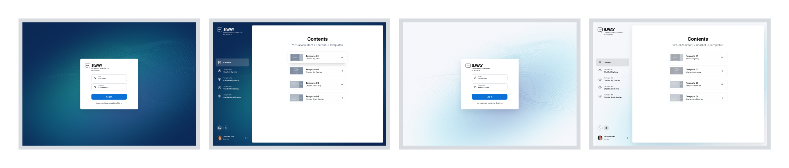
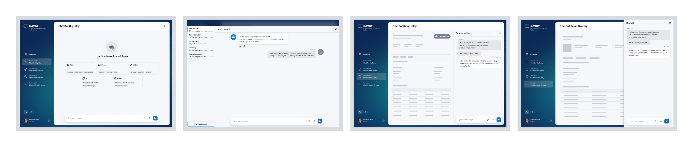
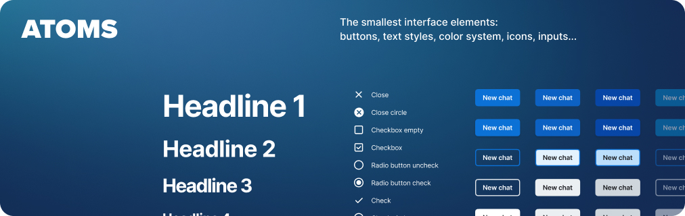
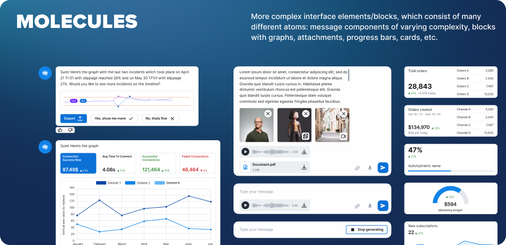
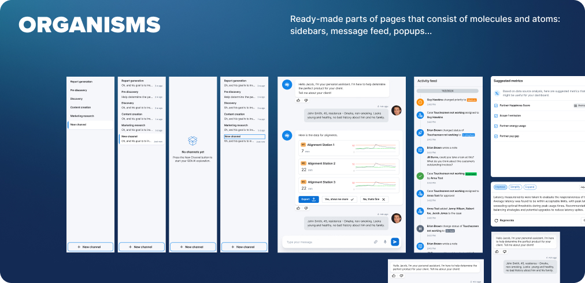
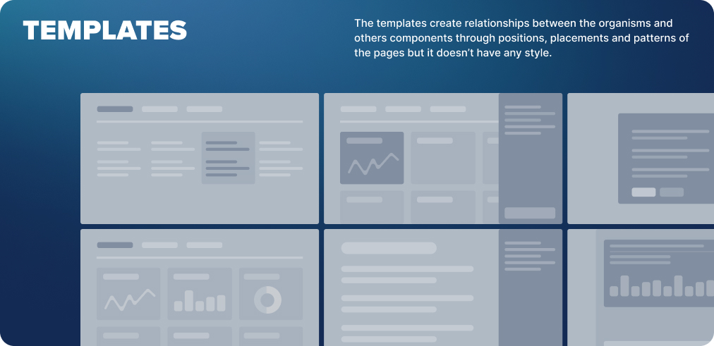
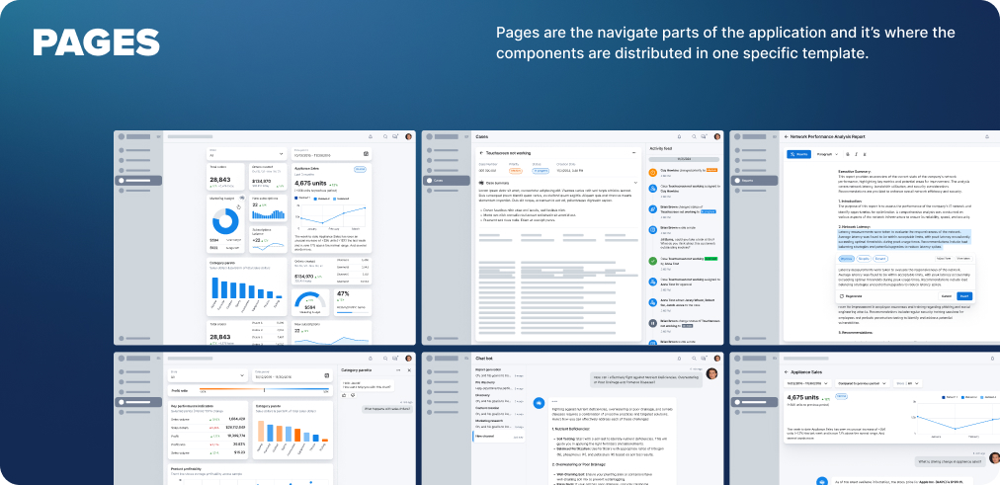

# {{ cookiecutter.project_title }} UI Kit

A design pattern and component library for {{ cookiecutter.project_title }} written using [Typescript](https://www.typescriptlang.org/) and [React](https://react.dev/). It's built with the [Atomic Design](https://atomicdesign.bradfrost.com/chapter-2/) methodology and leverages [Tailwind](https://tailwindcss.com/docs/installation) and [Storybook](https://storybook.js.org/docs/get-started/whats-a-story) capabilities for convenience of development.

    

The current UI Kit represents the [Design System](https://www.figma.com/file/fVynOfBsm6XFSQEpXvjrOr/SWAY-Gen-AI-UI-Kit?type=design&node-id=2048%3A2&mode=design&t=c7CgbKyF3buW9niQ-1) for [Hybrid Intent-Based Interfaces](https://www.figma.com/file/fVynOfBsm6XFSQEpXvjrOr/SWAY-Gen-AI-UI-Kit?type=design&node-id=2-79497&mode=design&t=fqoJwiuCN26kXEGO-0), whose main goal is to help accelerate Generative AI Explorations. Except for components, it also provides a typical [template for the representation](https://www.figma.com/file/fVynOfBsm6XFSQEpXvjrOr/SWAY-Gen-AI-UI-Kit?type=design&node-id=102%3A61463&mode=design&t=Zv7rsEza4jfIVAz7-1) of Virtual Assistants(Chatbots):

    
    
    
    

The general template concept also includes support for theming, offering both light and dark modes. Detailed visualizations can be found [here](https://www.figma.com/file/fVynOfBsm6XFSQEpXvjrOr/SWAY-Gen-AI-UI-Kit?type=design&node-id=35-59560&mode=design&t=r5p3CTYft9gCsUXV-0).

    
    

## 🎒 What is Atomic Design?

Popularly known within the design world, Atomic Design helps to build consistent, solid and reusable design systems. Plus, in the world of React, Vue and frameworks that stimulate the componentization, Atomic Design is used unconsciously; but when used in the right way, it becomes a powerful ally for developers.

The name Atomic Design comes from the idea of separating the components in atoms, molecules, organisms, templates and pages, like in the image above. But what are the responsibilities of each separated part?

### Atoms

 
Atoms are the smallest possible components, such as buttons, titles, inputs or event color pallets, animations, and fonts. They can be applied on any context, globally or within other components and templates, besides having many states, such as this example of button: disabled, hover, different sizes, etc.

### Molecules

 
They are the composition of one or more components of atoms. Here we begin to compose complex components and reuse some of those components. Molecules can have their own properties and create functionalities by using atoms, which don’t have any function or action by themselves.

### Organisms

 
Organisms are the combination of molecules that work together or even with atoms that compose more elaborate interfaces. At this level, the components begin to have the final shape, but they are still ensured to be independent, portable and reusable enough to be reusable in any content.

### Templates

 
In this state we stop composing components and begin to set their context. Moreover, the templates create relationships between the organisms and others components through positions, placements and patterns of the pages but it doesn’t have any style, color or component rendered. That’s why it looks like a wireframe.

### Pages

 
Pages are the navigate parts of the application and it’s where the components are distributed in one specific template. The components get real content and they’re connected with the whole application. At this stage, we can test the efficiency of the design system to analyse if all the components are independent enough or if we need to split them in smaller parts.

## 🌟 Features
Apart from components that can be used to create your assistant, the current library also includes the following features:
### Assistant
You can use described components, to build your own UI or you can use a ready-made solution is available that encompasses all necessary logic for interacting with an API, including state management and real-time streaming. This solution can be utilized as a `Standalone Chatbot`, `Popup`, or `Sidebar`.

How does it look?

    <image width="40%" src="./src/assets/images/dataviz/views/Default View.png"/>
    <image width="40%" src="./src/assets/images/dataviz/views/Popup View.png"/>
    <image width="40%" src="./src/assets/images/dataviz/views/Sidebar View.png"/>

### Bot Explorer

The primary purpose of this feature is to expedite API development and debugging by providing a UI interface. This interface facilitates faster API development. It can be used without needing to authenticate into the main app; all that is required is to provide a base endpoint for the API and an Access Token. It is assumed that you will develop the API using endpoints and contracts as defined by the Chatbot GenAI Template structure.

    <image width="40%" src="./src/assets/images/dataviz/bot-explorer/Configure.png"/>
    <image width="40%" src="./src/assets/images/dataviz/bot-explorer/Bot Explorer.png"/>

## 📕 How to run Storybook

1. Run `pnpm nx run ui:storybook:start` to start [Storybook](https://storybook.js.org/) in the development mode.
1. Open [http://localshost:3033](http://localshost:3033) to preview UI components.

## 🧰 Used technologies and libraries

- [Typescript](https://www.typescriptlang.org/) - a programming language, which adds static typing to JavaScript, enhancing code quality and maintainability by catching errors early in the development process.
- [React](https://react.dev/) - an open-source JavaScript library developed by Facebook for building user interfaces, particularly for single-page applications, where it excels in rendering efficient, interactive UIs with its component-based architecture and reactive data flow.
- [React Router](https://reactrouter.com/en/main/start/overview) - a library for React applications that provides declarative routing solutions, enabling the creation of dynamic and navigable single-page applications by managing browser history and rendering components based on the URL path.
- [Shadcn/UI](https://ui.shadcn.com/docs) - a collection of reusable components (**NOT** a component library) build over [Radix UI](https://www.radix-ui.com/themes/docs/overview/getting-started);
- [Tailwind CSS](https://tailwindcss.com/docs) - a utility-first CSS framework packed with classes like `flex`, `pt-4`, `text-center` and `rotate-90` that can be composed to build any design, directly in your markup.
- [Axios](https://axios-http.com/docs/intro) - a popular JavaScript library used to make XMLHttpRequests from the browser, supporting the [Promise API](https://javascript.info/promise-basics), and providing a simple and clean API for handling asynchronous data fetching.
- [Zustand](https://docs.pmnd.rs/zustand/getting-started/introduction) - a minimalistic and unopinionated state management library for React applications, known for its simplicity and ease of use, allowing developers to create global states and manage them without the boilerplate of more complex solutions like Redux.

## 🏰 Application structure

The application consists of the following files and directories:
- [`.storybook/`](./.storybook) - the directory with Storybook configs, `stubs` and `utils` used in components stories.
- [`src/`](./src) - the main directory with the application source code.
- [`declarations/`](./declarations/) - the directory with custom Typescript declarations used in project
- [`.eslintrc.js`](.eslintrc.js) -  file is a configuration file for [ESLint](https://eslint.org/docs/latest/), a static code analysis tool, used to define rules and settings for identifying and reporting on patterns in JavaScript and TypeScript, helping maintain code quality and consistency.
- [`components.json`](components.json) - [configuration file](https://ui.shadcn.com/docs/components-json) required by Shadcn/ui
- [`package.json`](package.json) - a central repository of metadata for the project, including project dependencies, scripts, version, and other configuration details, crucial for managing the project's modules and its interaction with the npm ecosystem.
- [`postcss.config.js`](postcss.config.js) -  a configuration file for PostCSS, a tool for transforming CSS with JavaScript plugins, where developers specify and customize the plugins used to preprocess CSS, enabling functionalities like autoprefixing, variables, and minification.
- [`README.md`](README.md) - this file with the documentation.
- [`tailwind.config.js`](tailwind.config.js) - a configuration file for Tailwind CSS, a utility-first CSS framework, where developers can customize and extend the framework's default settings, such as defining themes, breakpoints, and other design tokens specific to their project's design requirements.
- [`tsconfig.json`](tsconfig.json) - config file for Typescript, that specifies the root files and the compiler options required to compile the project, serving as a key tool for configuring TypeScript's behavior, such as setting the target JavaScript version, module resolution strategy, and various other compiler checks and optimizations.

